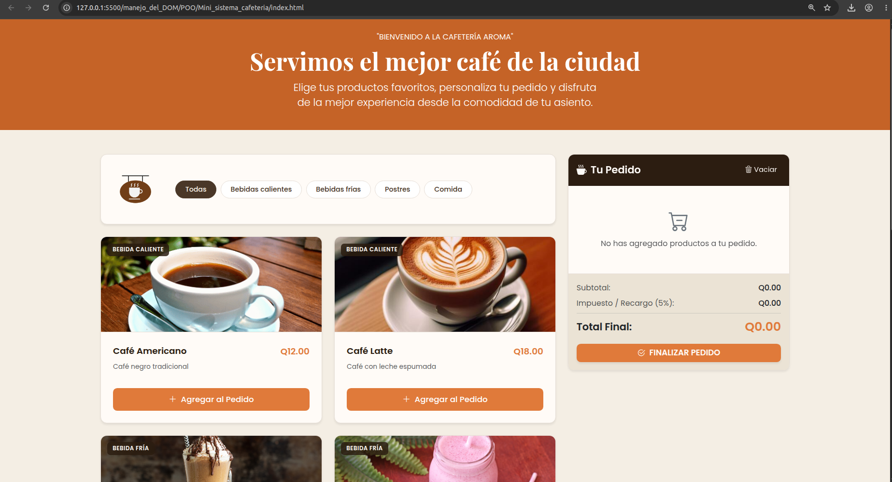
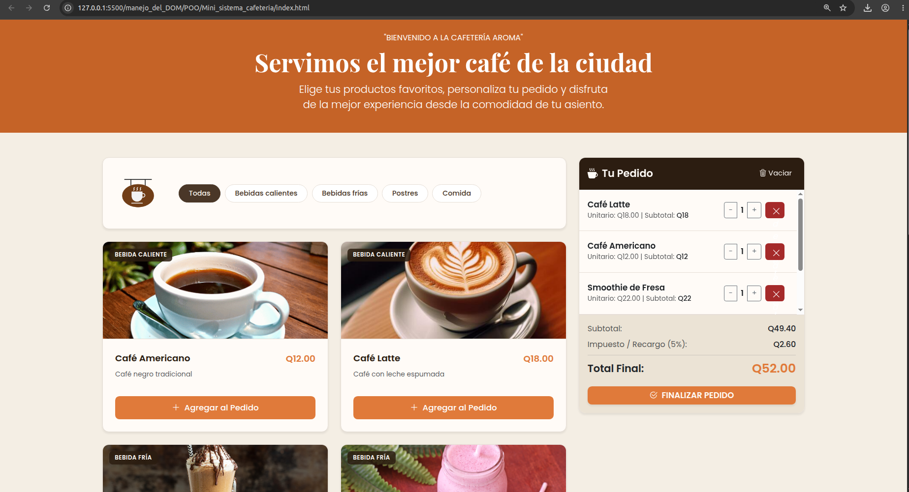
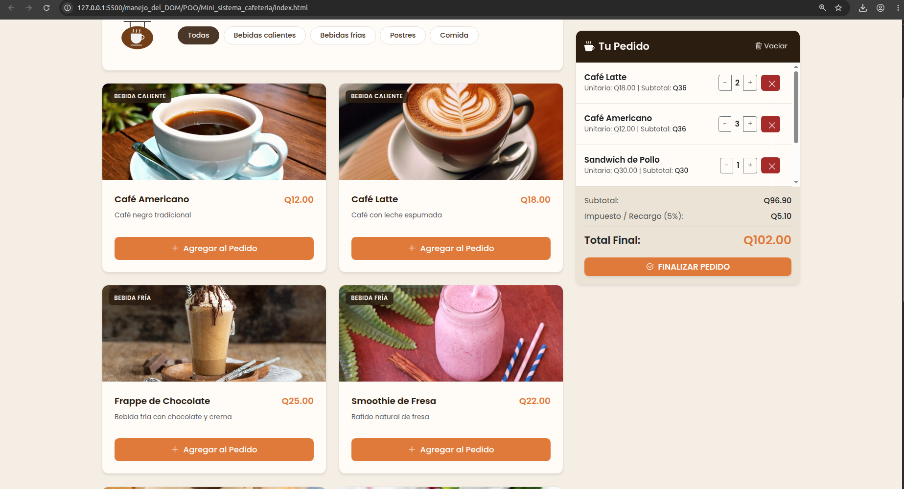
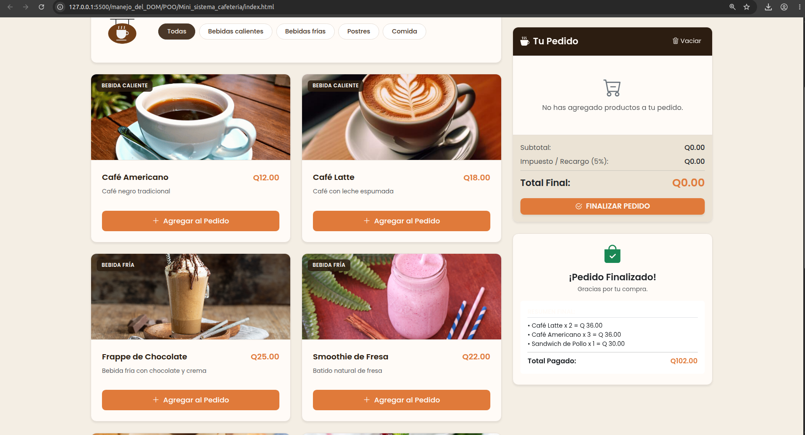

☕ Mini Sistema de Pedidos para Cafetería
Este proyecto es una aplicación web interactiva diseñada para simular el proceso de compra dentro de una cafetería. Permite a los usuarios explorar un catálogo de productos, gestionar un pedido en tiempo real sumando, restando o eliminando artículos, aplicar filtros por categoría y generar una factura final con cálculos automáticos de impuestos.

🚀 Características Principales
Programación Orientada a Objetos (POO): Uso de clases en JavaScript (Producto y Carrito) aplicando encapsulamiento estricto mediante atributos privados (#), métodos accesores (get/set) y control de lógica de negocio.

Gestión de Estado Dinámica: Control total del carrito de compras evitando duplicados visuales; si el producto ya existe, incrementa su cantidad de forma automática.

Interactividad con el DOM: Renderizado dinámico de productos y pedidos a través de eventos eficientes en el navegador.

Cálculos Automáticos: Desglose en tiempo real de subtotales, impuestos personalizados (5%) y totales finales del pedido.

Filtros Avanzados: Clasificación instantánea del catálogo por categorías (Bebidas calientes, Bebidas frías, Postres y Comida).

🛠️ Tecnologías Utilizadas
JavaScript (ES6+): Lógica del negocio, manipulación del DOM y POO.

HTML5 & CSS3: Estructuración y diseño estilizado con una interfaz limpia y moderna inspirada en una cafetería premium.

Bootstrap 5: Framework para el diseño responsivo y la alineación de componentes.

